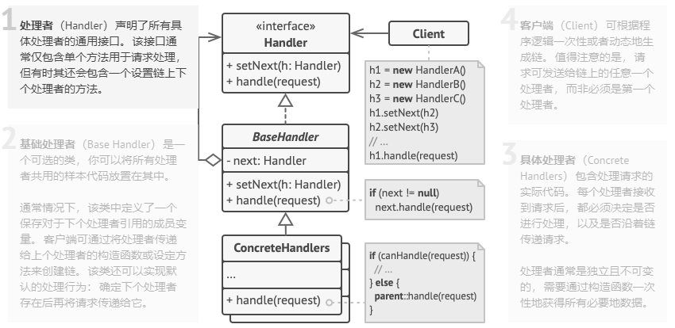

## 命令模式
**命令模式** 是一种行为设计模式，它可将请求转换为一个包含与请求相关的所有信息
的独立对象。该转换让你能根据不同的请求将方法参数化、延迟请求执行或将其放入
队列中，且能实现可撤销操作。
## 责任链模式结构

1. 处理者（Handler）声明了所有具体处理者的通用接口。该接口通常仅包含
单个方法用于请求处理，但有时其还会包含一个设置链上下个处理的方法。
2. 基础处理者（Base Handler）是一个可选的类，你可以将所有处理者共用的
样本代码放置在其中。
通常情况下，该类中定义了一个保存对于下个处理者引用的成员变量。客户端可通过将
处理者传递给上个处理者的构造函数或设定方法来创建链。该类还可以实现默认的处理行为：确定下个处理者的存在后再将请求传递给它。   
3. 具体处理者（Concrete Handler）包含处理请求的实际代码。每个处理者接收到
请求之后，都必须决定是否处理，以及是否沿着链传递请求。处理者通常是独立且不可变的。
通过构造函数一次性的获得所有必要地数据。
4. 客户端（Client）可根据逻辑顺序一次性或者动态的生成链。值得注意的是，请求发送给链
上的任意一个处理者，而非必须是第一个处理者。
## 责任链模式适合应用的场景
#### 当程序需要使用不同方式处理不同种类请求，而且请求类型和顺序预先未知时，可以使用责任链模式。
该模式可以将多个处理者连接成一条链。接收到请求后，它会”询问“每个处理者是否能够
对其进行处理。这样所有处理者都有机会来处理请求。
#### 当必须按照顺序执行多个处理者时，可以使用该模式。
无论你以何种顺序将处理者连成一条链，所有请求都会严格按照顺序通过链上的处理者。
#### 如果所需处理者及其顺序必须在运行时进行改变，可以使用责任链模式。
如果处理者类中有对引用成员变量的设定方法，你将能动态的插入和移除处理者，
或者改变其顺序。
## 实现方式
1. 声明处理者接口并描述请求处理方法的签名。

    确定客户端如何将请求数据传递给方法。最灵活的方式是将请求转换为对象，
   然后将其以参数的形式传递给处理函数。
2. 为了在具体处理者中消除重复的样本代码，你可以根据处理者接口创建抽象处理者基类。
    
    该类需要有一个成员变量来存储指向链上下个处理者的引用。你可以将其设置为不可
   变类。但如果你打算在运行时对链进行改变，则需要定义一个设定方法来修改引用成员变量的
   值。

   为了使用方便， 你还可以实现处理方法的默认行为。 如果还有剩余对象， 该方法会将请求传递给下个对象。 具体处理者还能够通过调用父对象的方法来使用这一行为。
3. 依次创建具体处理者子类并实现其处理方法。每个处理者在接收到请求后都必须作出
两个决定
   - 是否自行处理这个请求
   - 是否将该请求沿着链进行传递
4. 客户端可以自行组装链， 或者从其他对象处获得预先组装好的链。 在后一种情况下， 你必须实现工厂类以根据配置或环境设置来创建链。
5. 客户端可以触发链中的任意处理者， 而不仅仅是第一个。 请求将通过链进行传递， 直至某个处理者拒绝继续传递， 或者请求到达链尾。
6. 由于链的动态性， 客户端需要准备好处理以下情况：
    - 链中可能只有单个链接
    - 部分请求可能无法到达链尾
    - 其他请求可能直到链尾都未被处理
## 责任链的优缺点
### 优点
- 你可以控制请求处理顺序
- 单一职责原则。你可对发起操作和执行操作的类进行解耦
- 开闭原则。你可以在不更改现有代码的情况下在程序中新增处理者。
### 缺点
- 部分请求可能未被处理。
## 代码
### middleware
- Middleware
```java
package com.wl.behaviorpattern.cor.middleware;

/**
 * @author WL
 * @description: 基础认证接口
 * @date 2021/9/16 15:28
 */
public abstract class Middleware {
	private Middleware next;

	/**
	 * 构建中间件对象链。
	 * @author wl
	 * @date 2021/9/16 15:34
	 * @param next
	 * @return Middleware
	 */
	public Middleware linkWith(Middleware next){
		this.next = next;
		return next;
	}

	/**
	 * 子类将通过具体的检查实现这个方法
	 * @author wl
	 * @date 2021/9/16 15:33
	 * @param email 邮件
	 * @param password 密码
	 * @return boolean 返回值
	 */
	public abstract boolean check(String email , String password);

	/**
	 *运行链中下一个对象的检查，如果我们在链中，则结束遍历链中的最后一个对象。
	 * @author wl
	 * @date 2021/9/16 15:36
	 * @param email 邮箱
	 * @param password 密码
	 * @return boolean 返回值
	 */
	protected boolean checkNext(String email, String password){
		if (next == null){
			return true;
		}
		return next.checkNext(email, password);
	}

}
```
- RoleCheckMiddleware
```java
package com.wl.behaviorpattern.cor.middleware;

/**
 * @author WL
 * @description: 检查用户角色
 * @date 2021/9/16 15:44
 */
public class RoleCheckMiddleware extends Middleware{
	@Override
	public boolean check(String email, String password) {
		if (email.equals("admin@example.com")){
			System.out.println("Hello admin!");
			return true;
		}
		System.out.println("Hello ,User!");
		return checkNext(email, password);
	}
}
```
- ThrottlingMiddleware
```java
package com.wl.behaviorpattern.cor.middleware;

/**
 * @author WL
 * @description: 检查请求数量限制
 * @date 2021/9/16 15:37
 */
public class ThrottlingMiddleware extends Middleware{

	private int requestPerMinute;
	private int request;
	private long currentTime;

	public ThrottlingMiddleware(int requestPerMinute){
		this.requestPerMinute = requestPerMinute;
		this.currentTime = System.currentTimeMillis();
	}

	/**
	 * 请，不是说checkNext()调用可以插入两个开始的这种方法，并在最后。
	 * 这比在所有中间件上的简单循环提供了更多的灵活性对象。例如，链的一个元素可以改变顺序在所有其他检查之后运行它的检查。
	 * @author wl
	 * @date 2021/9/16 15:40
	 * @param email
	 * @param password
	 * @return boolean
	 */
	@Override
	public boolean check(String email, String password) {
		if (System.currentTimeMillis() > currentTime +60_000){
			request = 0;
			currentTime = System.currentTimeMillis();
		}
		request++;
		if (request > requestPerMinute) {
			System.out.println("Request limit exceed!");
			Thread.currentThread().stop();
		}
		return checkNext(email, password);
	}
}
```
- UserExistsMiddleware
```java
package com.wl.behaviorpattern.cor.middleware;

import com.wl.behaviorpattern.cor.server.Server;

/**
 * @author WL
 * @description: 检查用户的登录信息
 * @date 2021/9/16 15:55
 */
public class UserExistsMiddleware extends Middleware{

	private Server server;

	public UserExistsMiddleware(Server server){
		this.server = server;
	}

	@Override
	public boolean check(String email, String password) {
		if (!server.hasEmail(email)){
			System.out.println("这个账号没有注册！");
			return false;
		}
		if (!server.isValidPassword(email,password)){
			System.out.println("密码错误！");
			return false;
		}
		return checkNext(email, password);
	}
}
```
### server
- Server
```java
package com.wl.behaviorpattern.cor.server;

import com.wl.behaviorpattern.cor.middleware.Middleware;

import java.util.HashMap;
import java.util.Map;

/**
 * @author WL
 * @description: 授权目标
 * @date 2021/9/16 15:47
 */
public class Server {
	private Map<String , String> users = new HashMap<>();
	private Middleware middleware;

	/**
	 * 客户端向服务器传递一个对象链。这提高了灵活性
	 * 使测试服务器类更容易。在所有其他检查之后运行它的检查。
	 * @author wl
	 * @date 2021/9/16 15:49
	 * @param middleware
	 */
	public void setMiddleware(Middleware middleware) {
		this.middleware = middleware;
	}

	/**
	 *服务器从客户端获取电子邮件和密码并发送授权
	 *请求链。
	 * @author wl
	 * @date 2021/9/16 15:51
	 * @param email
	 * @param password
	 * @return boolean
	 */
	public boolean login(String email, String password){
		if (middleware.check(email, password)){
			System.out.println("授权成功!");
			return true;
		}
		return false;
	}

	public void register(String email, String password){
		users.put(email, password);
	}

	public boolean hasEmail(String email) {
		return users.containsKey(email);
	}

	public boolean isValidPassword(String email, String password){
		return users.get(email).equals(password);
	}
}
```
### Demo
```java
package com.wl.behaviorpattern.cor.server;

import com.wl.behaviorpattern.cor.middleware.Middleware;

import java.util.HashMap;
import java.util.Map;

/**
 * @author WL
 * @description: 授权目标
 * @date 2021/9/16 15:47
 */
public class Server {
	private Map<String , String> users = new HashMap<>();
	private Middleware middleware;

	/**
	 * 客户端向服务器传递一个对象链。这提高了灵活性
	 * 使测试服务器类更容易。在所有其他检查之后运行它的检查。
	 * @author wl
	 * @date 2021/9/16 15:49
	 * @param middleware
	 */
	public void setMiddleware(Middleware middleware) {
		this.middleware = middleware;
	}

	/**
	 *服务器从客户端获取电子邮件和密码并发送授权
	 *请求链。
	 * @author wl
	 * @date 2021/9/16 15:51
	 * @param email
	 * @param password
	 * @return boolean
	 */
	public boolean login(String email, String password){
		if (middleware.check(email, password)){
			System.out.println("授权成功!");
			return true;
		}
		return false;
	}

	public void register(String email, String password){
		users.put(email, password);
	}

	public boolean hasEmail(String email) {
		return users.containsKey(email);
	}

	public boolean isValidPassword(String email, String password){
		return users.get(email).equals(password);
	}
}
```