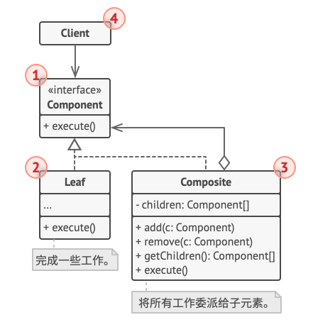
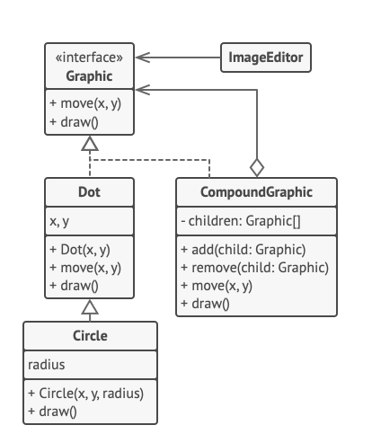

# Java 设计模式——组合模式
**组合模式** 是一种结构型设计模式，可以使用它将对象组合成
树状结构，并且能够像使用独立对象一样使用它们。
## 组合模式结构
1. **组件** （Component）接口描述了树中简单项目和复杂项目所共有的操作
2. **叶节点** （Leaf）是树的基本结构，它不包含子项目。

    一般情况下叶节点最终会完成大部分的实际工作，因为它们无法将工作指派给其他部分。
3. 容器 （Container）——又名“组合（Composite）“——是包含叶节点或其他容器等子项目的单位。
容器不知道其子项目所属的具体类，它只通过通用的组件接口与其子项目交互。
   
    容器接收到请求后会将工作分配给自己的子项目，处理中间结果，然后将最终结果返回给客户端。
4. 客户端（Client）通过组件接口与所有项目交互。因此，客户端能以相同方式与树状结构中简单或复杂项目交互。

## 代码
### 伪代码

### 具体实现
#### editor
- ImageEditor
```java
package com.wl.composite.editor;

import com.wl.composite.shapes.CompoundShape;
import com.wl.composite.shapes.Shape;

import javax.swing.*;
import javax.swing.border.Border;
import java.awt.*;
import java.awt.event.MouseAdapter;
import java.awt.event.MouseEvent;

/**
 * @author WL
 * @description: 形状编辑器
 * @date 2021/9/6 14:23
 */
public class ImageEditor {
	private EditorCanvas canvas;
	private CompoundShape allShapes = new CompoundShape();
	public ImageEditor(){
		canvas = new EditorCanvas();
	}
	public void loadShapes(Shape... shapes){
		allShapes.clear();
		allShapes.add(shapes);
		canvas.refresh();
	}

	private class EditorCanvas extends Canvas {
		JFrame frame;
		private static final int PADDING = 10;
		EditorCanvas(){
			createFrame();
			refresh();
			addMouseListener(new MouseAdapter() {
				@Override
				public void mousePressed(MouseEvent e) {
					allShapes.unSelect();
					allShapes.selectChildAt(e.getX(),e.getY());
					e.getComponent().repaint();
				}
			});
		}
		void createFrame(){
			frame = new JFrame();
			frame.setDefaultCloseOperation(WindowConstants.EXIT_ON_CLOSE);
			frame.setLocationRelativeTo(null);

			JPanel contentPanel = new JPanel();
			Border padding = BorderFactory.createEmptyBorder(PADDING,PADDING,PADDING,PADDING);
			contentPanel.setBorder(padding);
			frame.setContentPane(contentPanel);

			frame.add(this);
			frame.setVisible(true);
			frame.getContentPane().setBackground(Color.LIGHT_GRAY);
		}
		@Override
		public int getWidth(){
			return allShapes.getX() +allShapes.getWidth()+PADDING;
		}
		@Override
		public int getHeight(){
			return allShapes.getHeight()+ allShapes.getY()+PADDING;
		}
		void refresh(){
			this.setSize(getWidth(),getHeight());
			frame.pack();
		}
		@Override
		public void paint(Graphics graphics){
			allShapes.paint(graphics);
		}
	}
}
```
#### shapes
- BaseShape
```java
package com.wl.composite.shapes;

import java.awt.*;

/**
 * @author WL
 * @description: 提供基本功能的抽象形状
 * @date 2021/9/6 13:18
 */
public class BaseShape implements Shape{
	public int x;
	public int y;
	public Color color;
	private boolean select = false;

	BaseShape(int x, int y, Color color){
		this.x = x;
		this.y = y;
		this.color = color;
	}
	@Override
	public int getX() {
		return x;
	}

	@Override
	public int getY() {
		return y;
	}

	@Override
	public int getWidth() {
		return 0;
	}

	@Override
	public int getHeight() {
		return 0;
	}

	@Override
	public void move(int x, int y) {
		this.x += x;
		this.y += y;
	}

	@Override
	public boolean isInsideBounds(int x, int y) {
		return x > getX() && x < (getX() + getWidth()) &&
				y > getY() && y < (getY() + getHeight());
	}

	@Override
	public void select() {
		select = true;
	}

	@Override
	public void unSelect() {
		select = false;
	}

	@Override
	public boolean isSelect() {
		return select;
	}

	void enableSelectionStyle(Graphics graphics){
		graphics.setColor(Color.LIGHT_GRAY);

		Graphics2D g2 = (Graphics2D) graphics;
		float[] dash1 = {2.0f};
		g2.setStroke(new BasicStroke(1.0f,
				BasicStroke.CAP_BUTT,
				BasicStroke.JOIN_MITER,
				2.0f, dash1, 0.0f));
	}

	void disableSelectionStyle(Graphics graphics){
		graphics.setColor(color);
		Graphics2D g2 = (Graphics2D) graphics;
		g2.setStroke(new BasicStroke());
	}
	@Override
	public void paint(Graphics graphics) {
		if (isSelect()){
			enableSelectionStyle(graphics);
		} else {
			disableSelectionStyle(graphics);
		}
	}
}
```
- Circle
```java
package com.wl.composite.shapes;

import java.awt.*;

/**
 * @author WL
 * @description: 圆形
 * @date 2021/9/6 13:31
 */
public class Circle extends BaseShape{
	public int radius;

	public Circle(int x, int y, int radius, Color color) {
		super(x, y, color);
		this.radius = radius;
	}

	@Override
	public int getWidth() {
		return radius * 2;
	}

	@Override
	public int getHeight() {
		return radius * 2;
	}

	@Override
	public void paint(Graphics graphics) {
		super.paint(graphics);
		graphics.drawRect(x,y,getWidth() - 1,getHeight() - 1);
	}
}
```
- CompoundShape
```java
package com.wl.composite.shapes;

import java.awt.*;
import java.util.ArrayList;
import java.util.Arrays;
import java.util.List;

/**
 * @author WL
 * @description: 由其它形状对象组成的复合形状
 * @date 2021/9/6 13:42
 */
public class CompoundShape extends BaseShape{
	protected List<Shape> children = new ArrayList<>();
	public CompoundShape(Shape... components){
		super(0,0,Color.black);
		add(components);
	}
	public void add(Shape component){
		children.add(component);
	}
	public void add(Shape... components){
		children.addAll(Arrays.asList(components));
	}
	public void remove(Shape child) {
		children.remove(child);
	}
	public void remove(Shape... components){
		children.removeAll(Arrays.asList(components));
	}
	public void clear(){
		children.clear();
	}

	@Override
	public int getX() {
		if (children.size() == 0){
			return 0;
		}
		int x = children.get(0).getX();
		for (Shape child : children){
			if (child.getX() < x){
				x = child.getX();
			}
		}
		return x;
	}

	@Override
	public int getY() {
		if (children.size() == 0){
			return 0;
		}
		int y = children.get(0).getY();
		for (Shape child : children){
			if (child.getY() < y){
				y = child.getY();
			}
		}
		return y;
	}

	@Override
	public int getWidth() {
		int maxWidth = 0;
		int x = getX();
		for (Shape child : children){
			int childRelativeX = child.getX() - x;
			int childWidth = childRelativeX + child.getWidth();
			if (childWidth > maxWidth){
				maxWidth = childWidth;
			}
		}
		return maxWidth;
	}

	@Override
	public int getHeight() {
		int maxHeight = 0;
		int y = getY();
		for (Shape child : children){
			int childRelativeY = child.getY() - y;
			int childHeight = childRelativeY + child.getHeight();
			if (childHeight > maxHeight) {
				maxHeight = childHeight;
			}
		}
		return maxHeight;
	}

	@Override
	public void move(int x, int y) {
		for (Shape child : children){
			child.move(x,y);
		}
	}

	@Override
	public boolean isInsideBounds(int x, int y) {
		for (Shape child : children) {
			if (child.isInsideBounds(x,y)){
				return true;
			}
		}
		return false;
	}

	@Override
	public void unSelect() {
		super.unSelect();
		for (Shape child : children){
			child.unSelect();
		}
	}
	public boolean selectChildAt(int x, int y){
		for (Shape child : children) {
			if (child.isInsideBounds(x,y)){
				child.select();
				return true;
			}
		}
		return false;
	}

	@Override
	public void paint(Graphics graphics) {
		if (isSelect()){
			enableSelectionStyle(graphics);
			graphics.drawRect(getX() - 1,getY() - 1,getWidth() + 1,getHeight() + 1);
			disableSelectionStyle(graphics);
		}
		for (Shape child : children){
			child.paint(graphics);
		}
	}
}
```
- Dot
```java
package com.wl.composite.shapes;

import java.awt.*;

/**
 * @author WL
 * @description: 点
 * @date 2021/9/6 13:26
 */
public class Dot extends BaseShape{
	private final int DOT_SIZE = 3;
	public Dot(int x, int y, Color color){
		super(x,y,color);
	}

	@Override
	public int getWidth() {
		return DOT_SIZE;
	}

	@Override
	public int getHeight() {
		return DOT_SIZE;
	}

	@Override
	public void paint(Graphics graphics) {
		super.paint(graphics);
		graphics.fillRect(x - 1,y - 1,getWidth(),getHeight());
	}
}
```
- Rectangle
```java
package com.wl.composite.shapes;

import java.awt.*;

/**
 * @author WL
 * @description: 三角形
 * @date 2021/9/6 13:39
 */
public class Rectangle extends BaseShape{
	public int width;
	public int height;

	public Rectangle(int x, int y, int width, int height, Color color) {
		super(x, y, color);
		this.height = height;
		this.width = width;
	}

	@Override
	public int getWidth() {
		return width;
	}

	@Override
	public int getHeight() {
		return height;
	}

	@Override
	public void paint(Graphics graphics) {
		super.paint(graphics);
		graphics.drawRect(x,y,getWidth() - 1,getHeight() - 1);
	}
}
```
- Shape
```java
package com.wl.composite.shapes;

import java.awt.*;

/**
 * @author WL
 * @description: 通用形状接口
 * @date 2021/9/6 11:03
 */
public interface Shape {
	int getX();
	int getY();
	int getWidth();
	int getHeight();
	void move(int x, int y);
	boolean isInsideBounds(int x, int y);
	void select();
	void unSelect();
	boolean isSelect();
	void paint(Graphics graphics);
}
```
#### Demo
```java
package com.wl.composite;

import com.wl.composite.editor.ImageEditor;
import com.wl.composite.shapes.Circle;
import com.wl.composite.shapes.CompoundShape;
import com.wl.composite.shapes.Dot;
import com.wl.composite.shapes.Rectangle;

import java.awt.*;

/**
 * @author WL
 * @description: 测试
 * @date 2021/9/6 14:39
 */
public class Demo {
	public static void main(String[] args) {
		ImageEditor editor = new ImageEditor();
		editor.loadShapes(
				new Circle(10,10,10, Color.blue),
				new CompoundShape(
						new Circle(110,110,50,Color.RED),
						new Dot(160,160,Color.red)
				),
				new CompoundShape(
						new Rectangle(250,250,100,100,Color.GREEN),
						new Dot(240,240,Color.GREEN),
						new Dot(240,360,Color.GREEN),
						new Dot(360,360,Color.GREEN),
						new Dot(360,240,Color.GREEN)
				)
		);
	}
}
```