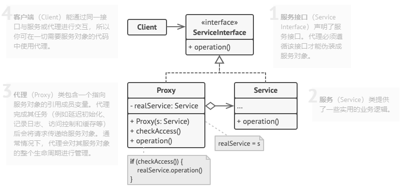

# 代理模式
代理模式是一种结构型设计模式，让你能够提供对象的替代品或其占位符。代理控制着对于原对象的
访问，并允许在将请求提交给对象进行一些处理。

代理模式建议新建一个与原服务对象接口相同的代理类，然后更新应用以代理对象
传递给所有原始对象的客户端。代理类接收到客户端请求后会创建实际的服务对象，
并经所有工作委派给它。
## 代理模式结构

1. **服务接口** （Service Interface）声明了服务接口。代理必须遵循
该接口才能伪装成服务对象。
2. **服务** （Service） 类提供了一些实用的业务逻辑。
3. **代理** （Proxy）类包含一个指向服务对象的引用成员变量。代理完成其任务
（例如延迟初始化、记录日志、访问控制和缓存等）后会将请求传递给服务对象。 
 通常情况下，代理会对其服务对象的整个生命周期进行管理。
4. **客户端** （Client）能通过同一接口与服务或代理进行交互，所以你可以在
一切需要服务对象的代码中使用代理。
## 代理模式适合应用场景
#### 延迟初始化（虚拟代理）。如果你有一个偶尔使用的重量级服务对象，一直保持该对象运行会消耗系统资源时，可以使用代理模式。
你无需在程序启动时就创建该对象，可将对象的初始化延迟到真正有需要的时候。
#### 访问控制（保护代理）。如果你只希望特定客户端使用服务对象，这里的对象可以是操作系统中非常重要的部分，而客户端则是各自已启动的程序（包括恶意程序），此时可以使用代理模式。
代理可仅在客户端凭据满足要求时将请求传递给服务对象。
#### 本地执行远程服务（远程代理)。适用于服务对象位于远程服务器上的情形。
在这种情况下，代理通过网络传递客户端请求，负责处理所有与网络相关的复杂细节。
#### 本地执行远程服务（日志记录代理）。适用于当你需要保存对于服务对象的请求历史记录时。代理可以在向服务传递请求前进记录。
缓存请求结果（缓存代理）。适用于需要缓存客户请求结果并对缓存生命周期进行管理时，特别是当返回结果的体积非常大时。
- 代理可以对重复请求所需的相同结果进行缓存，还可以使用请求参数作为缓存的键值。
#### 智能引用。可在没有客户端使用某个重量级对象时立即销毁该对象。
代理会将所有获取了指向服务对象或其结果的客户端记录在案。代理会时不时地遍历各个客户端，
检查他们是否仍在运行。如果相应的客户端列表为空，代理就会销毁该服务对象，释放底层系统资源。

代理还可以记录客户端是否修改了服务对象。其他客户端还可以复用未修改的对象。
## 实现方式
1. 如果没有现成的服务接口，你就需要创建一个接口来实现代理和服务对象的可交换性。从
服务类中抽取接口并非都是可行的，因为你需要对服务的所有客户端进行修改，让
它们使用接口。备选计划是将代理作为服务类的子类，这样代理就能继承服务的所有接口。
2. 创建代理类，其中必须包含一个含有存储指向服务的引用的成员变量。通常情况下，代理负责创建
服务并对其整个生命周期进行管理。在一些特殊情况下，客户端会通过构造函数将服务传递给代理。
3. 根据需求实现代理方法。在大部分情况下，代理在完成一些任务后应将工作委派给服务对象。
4. 可以考虑新建一个构造方法来判断客户端可获取的是代理还是实际服务。你可以在代理类中创建一个简单的静态方法，也可以创建一个完整的工厂方法。
5. 可以考虑为服务对象实现延迟初始化。
## 代理模式的优缺点
### 优点
- 你可以在客户端毫不知情的情况下控制服务对象。
- 如果客户端对服务对象的生命周期没有特殊要求，你可以对生命周期进行管理。
- 即使服务对象还未准备好或不存在，代理也可以正常工作。
- 开闭原则。 你可以在不对服务或客户端作出修改的情况下创建新代理。
### 缺点
- 代码可能会变得复杂，因为需要新建许多类。
- 服务响应可能会延迟。
## 代码
### downloder
- YouTubeDownloader
```java
package com.wl.proxy.downloder;

import com.wl.proxy.some_cool_media_library.ThirdPartyYouTubeLib;
import com.wl.proxy.some_cool_media_library.Video;

import java.util.HashMap;

/**
 * @author WL
 * @description: 媒体下载应用
 * @date 2021/9/15 16:13
 */
public class YouTubeDownloader {
	private ThirdPartyYouTubeLib api;

	public YouTubeDownloader(ThirdPartyYouTubeLib api){
		this.api = api;
	}

	public void renderVideoPage(String videoId) throws InterruptedException {
		Video video = api.getVideo(videoId);
		System.out.println("\n-------------------------------");
		System.out.println("Video page (imagine fancy HTML)");
		System.out.println("ID: " + video.id);
		System.out.println("Title: " + video.title);
		System.out.println("Video: " + video.data);
		System.out.println("-------------------------------\n");
	}
	public void renderPopularVideos() throws InterruptedException {
		HashMap<String, Video> list = api.popularVideos();
		System.out.println("\n-------------------------------");
		System.out.println("Most popular videos on YouTube (imagine fancy HTML)");
		for (Video video : list.values()) {
			System.out.println("ID: " + video.id + " / Title: " + video.title);
		}
		System.out.println("-------------------------------\n");
	}
}
```
### proxy
- YouTubeCacheProxy
```java
package com.wl.proxy.proxy;

import com.wl.proxy.some_cool_media_library.ThirdPartyYouTubeLib;
import com.wl.proxy.some_cool_media_library.ThirdPartyYouTubeLibImpl;
import com.wl.proxy.some_cool_media_library.Video;

import java.util.HashMap;

/**
 * @author WL
 * @description: 缓存代理
 * @date 2021/9/15 16:01
 */
public class YouTubeCacheProxy implements ThirdPartyYouTubeLib {
	private ThirdPartyYouTubeLib youTubeLib;
	private HashMap<String, Video> cachePopular = new HashMap<String, Video>();
	private HashMap<String, Video> cacheAll = new HashMap<String, Video>();

	public YouTubeCacheProxy(){
		this.youTubeLib = new ThirdPartyYouTubeLibImpl();
	}
	@Override
	public HashMap<String, Video> popularVideos() throws InterruptedException {
		if (cachePopular.isEmpty()){
			cachePopular = youTubeLib.popularVideos();
		} else {
			System.out.println("Retrieved list from cache");
		}
		return cachePopular;
	}

	@Override
	public Video getVideo(String videoId) throws InterruptedException {
		Video video = cacheAll.get(videoId);
		if (video == null){
			video = youTubeLib.getVideo(videoId);
			cacheAll.put(videoId,video);
		} else {
			System.out.println("Retrieved video" + videoId + "from cache!");
		}
		return video;
	}

	public void reset(){
		cachePopular.clear();
		cacheAll.clear();
	}
}
```
### some_cool_media_library
- ThirdPartyYouTubeLib
```java
package com.wl.proxy.some_cool_media_library;

import java.util.HashMap;

/**
 * @author WL
 * @description: 远程服务接口
 * @date 2021/9/15 14:32
 */
public interface ThirdPartyYouTubeLib {
	/**
	 * 流行
	 * @author wl
	 * @date 2021/9/15 15:15
	 * @return HashMap<Video>
	 */
	HashMap<String,Video> popularVideos() throws InterruptedException;
	/**
	 * 获取
	 * @author wl
	 * @date 2021/9/15 14:34
	 * @param videoId
	 * @return Video
	 */
	Video getVideo(String videoId) throws InterruptedException;

}
```
- ThirdPartyYouTubeLibImpl
```java
package com.wl.proxy.some_cool_media_library;

import java.util.HashMap;

/**
 * @author WL
 * @description: 远程服务实现
 * @date 2021/9/15 14:35
 */
public class ThirdPartyYouTubeLibImpl implements ThirdPartyYouTubeLib{
	@Override
	public HashMap<String, Video> popularVideos() throws InterruptedException {
		connectToServer("https://www.youtube.com");
		return getRandomVideos();
	}

	@Override
	public Video getVideo(String videoId) throws InterruptedException {
		connectToServer("https://www.youtube.com/" + videoId);
		return getSomeVideo(videoId);
	}

	private int random(int max, int min){
		return min + (int) (Math.random() * ((max - min) + 1));
	}

	private void experienceNetworkLatency() throws InterruptedException {
		int randomLatency = random(5, 10);
		for (int i = 0; i < randomLatency; i++){
			Thread.sleep(100);
		}
	}

	private void connectToServer(String server) throws InterruptedException {
		System.out.println("Connecting to "+ server + "...");
		experienceNetworkLatency();
		System.out.println("Connected!" + "\n");
	}

	private HashMap<String , Video> getRandomVideos() throws InterruptedException {
		System.out.println("Downloading populars...");

		experienceNetworkLatency();
		HashMap<String, Video> hmap = new HashMap<String, Video>();
		hmap.put("catzzzzzzzzz", new Video("sadgahasgdas", "Catzzzz.avi"));
		hmap.put("mkafksangasj", new Video("mkafksangasj", "Dog play with ball.mp4"));
		hmap.put("dancesvideoo", new Video("asdfas3ffasd", "Dancing video.mpq"));
		hmap.put("dlsdk5jfslaf", new Video("dlsdk5jfslaf", "Barcelona vs RealM.mov"));
		hmap.put("3sdfgsd1j333", new Video("3sdfgsd1j333", "Programing lesson#1.avi"));

		System.out.println("Done! " + "\n");
		return hmap;
	}

	private Video getSomeVideo(String videoId) throws InterruptedException {
		System.out.println("Downloading video...");

		experienceNetworkLatency();
		Video video = new Video(videoId, "Some video title!");

		System.out.println("Done!" + "\n");
		return video;
	}
}
```
- Video
```java
package com.wl.proxy.some_cool_media_library;

/**
 * @author WL
 * @description:
 * @date 2021/9/15 14:35
 */
public class Video {
	public String id;
	public String title;
	public String data;

	Video(String id, String title){
		this.id = id;
		this.data = "Random video";
		this.title = title;
	}
}
```
### Demo
```java
package com.wl.proxy;

import com.wl.proxy.downloder.YouTubeDownloader;
import com.wl.proxy.proxy.YouTubeCacheProxy;
import com.wl.proxy.some_cool_media_library.ThirdPartyYouTubeLibImpl;

/**
 * @author WL
 * @description: 测试类
 * @date 2021/9/15 16:18
 */
public class Demo {
	public static void main(String[] args) throws InterruptedException {
		YouTubeDownloader naiveDownloader = new YouTubeDownloader(new ThirdPartyYouTubeLibImpl());
		YouTubeDownloader smartDownloader = new YouTubeDownloader(new YouTubeCacheProxy());
		test(naiveDownloader);
		test(smartDownloader);
	}

	private static long test(YouTubeDownloader downloader) throws InterruptedException {
		long startTime = System.currentTimeMillis();

		downloader.renderPopularVideos();
		downloader.renderVideoPage("catzzzzzzzzz");
		downloader.renderPopularVideos();
		downloader.renderVideoPage("dancesvideoo");
		// Users might visit the same page quite often.
		downloader.renderVideoPage("catzzzzzzzzz");
		downloader.renderVideoPage("someothervid");

		long estimatedTime = System.currentTimeMillis() - startTime;
		System.out.print("Time elapsed: " + estimatedTime + "ms\n");
		return estimatedTime;
	}
}
```
