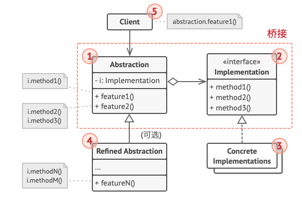

# Java设计模式——桥接模式
**桥接模式**是一种结构型设计模式，可将一个大类或一系列紧密
相关的类拆分为抽象和实现两个独立的层次结构，从而能在开发时分别使用。
## 桥接模式结构
1. **抽象部分**（Abstraction）提供高层控制逻辑，依赖于完成底层实际工作的实现对象。

2. **实现部分（Implementation）为所有具体实现声明通用接口。抽象部分仅能通过在这里声明的方法与实现对象交互。

    抽象部分可以列出和实现部分一样的方法，但是抽象部分通常声明一些复杂行为，
    这些行为依赖于多种由实现部分声明的原语操作。 

3. 具体实现（Concrete Implementations）中包括特定于平台的代码。

4. 精确抽象（Refined Abstraction）提供控制逻辑的变体。与其父类一样，它们通过实现接口与不同的实现进行交互。

5. 通常情况下，客户端（Client）仅关心如何与抽象部分合作。但是，客户端需要将抽象对象与一个实现对象连接起来。

## 桥接模式适用场景
#### 如果你想要拆分或重组一个具有多重功能的庞杂类（列如能与多个数据库服务器进行交互的类），可以使用桥接模式
桥接模式可以将庞杂类拆分为几个类层次结构。此后，你可以修改任意一个类层次结构而不会影响到其他类层次结构。这种方法可以简化代码的维护工作，并将修改已有代码的风险降到最低。
#### 如果你希望在几个独立维度上扩展一个类，可使用该模式。
桥接建议将每个维度抽取为独立的类层次。初始类将相关工作委派给属于对应类层次的对象，无需自己完成所有工作。
#### 如果你需要在运行时切换不同的实现方法，可以用桥接模式。
## 实现方式
1. 明确类中独有的维度。独立的概念可能是：抽象/平台，域/基础设施，前端/后端或接口/实现。
2. 了解客户端的业务需求，并在抽象基类中定义它们。
3. 确定在所有平台上都可执行的业务。并在通用实现接口中声明抽象部分所需的业务。
4. 为你域内的所有平台创建实现类，但需要确保他们遵循实现部分的接口。
5. 在抽象类中添加指向实现类型的引用成员变量。抽象部分会将大部分工作委派给该成员变量所指向的实现对象。
6. 如果你的高层逻辑有多个变体，则可通过扩展抽象基类为每个变体创建一个精确抽象。
7. 客户端代码必须将实现对象传递给抽象部分的构造函数才能使其能够相互关联。此后，客户端只需与抽象对象进行交互，无需和
实现对象打交道。
## 桥接模式的优缺点
### 优点
- 你可以创建与平台无关的类和程序。
- 客户端代码仅与高层抽象部分进行互动，不会接触到平台的详细信息。
- 开闭原则。你可以新增抽象部分和实现部分，且它们之间不会相互影响。
- 单一职责原则。抽象部分专注于处理高层逻辑，实现部分处理平台细节。
### 缺点
- 对高内聚的类使用该模式可能会让代码更加复杂。
## 代码实现
### device 
- Device
```java
package com.wl.bridge.device;

/**
 * 所有设备的通用接口
 * @author 98710
 */
public interface Device {
    boolean isEnable();
    void enable();
    void disable();
    int getVolume();
    void setVolume(int  percent);
    int getChannel();
    void setChannel(int channel);
    void printStatus();
}
```
- Radio
```java
package com.wl.bridge.device;

/**
 * @Author Mr_wan
 * @Description TODO $
 * @Date $ 2021.09.03$
 * @Param 收音机$
 * @return $
 */
public class Radio implements Device{
	private boolean on = false;
	private int volume = 30;
	private int channel = 1;

	@Override
	public boolean isEnable() {
		return on;
	}

	@Override
	public void enable() {
		on = true;
	}

	@Override
	public void disable() {
		on = false;
	}

	@Override
	public int getVolume() {
		return volume;
	}

	@Override
	public void setVolume(int percent) {
		if (volume >= 100) {
			this.volume = 100;
		} else if (volume < 0){
			this.volume = 0;
		} else {
			this.volume = volume;
		}
	}

	@Override
	public int getChannel() {
		return channel;
	}

	@Override
	public void setChannel(int channel) {
		this.channel = channel;
	}

	@Override
	public void printStatus() {
		System.out.println("| ---------------------------------");
		System.out.println("| i'm radio.");
		System.out.println("| I'm "+ (on ? "enable" : "disable"));
		System.out.println("| Current volume is " + volume + "%");
		System.out.println("| Current channel is " + channel);
		System.out.println("-----------------------------------");
	}
}
```
- TV
```java
package com.wl.bridge.device;

/**
 * @author WL
 * @description: 电视机
 * @date 2021/9/3 11:10
 */
public class TV implements Device{
	private boolean on = false;
	private int volume = 30;
	private int channel = 1;

	@Override
	public boolean isEnable() {
		return on;
	}

	@Override
	public void enable() {
		on = true;
	}

	@Override
	public void disable() {
		on = false;
	}

	@Override
	public int getVolume() {
		return volume;
	}

	@Override
	public void setVolume(int percent) {
		if (volume >= 100) {
			this.volume = 100;
		} else if (volume < 0){
			this.volume = 0;
		} else {
			this.volume = volume;
		}
	}

	@Override
	public int getChannel() {
		return channel;
	}

	@Override
	public void setChannel(int channel) {
		this.channel = channel;
	}

	@Override
	public void printStatus() {
		System.out.println("-----------------------------------");
		System.out.println("| i'm TV.");
		System.out.println("| I'm "+ (on ? "enable" : "disable"));
		System.out.println("| Current volume is " + volume + "%");
		System.out.println("| Current channel is " + channel);
		System.out.println("-----------------------------------");
	}
}
```
### remotes
- AdvancedRemote
```java
package com.wl.bridge.remotes;

import com.wl.bridge.device.Device;

/**
 * @author WL
 * @description: 高级远程控制器
 * @date 2021/9/3 11:38
 */
public class AdvancedRemote extends BasicRemote{
	public AdvancedRemote(Device device) {
		super.device = device;
	}
	public void mute(){
		System.out.println("Remote : mute");
		device.setVolume(0);
	}

}
```
- BasicRemote
```java
package com.wl.bridge.remotes;

import com.wl.bridge.device.Device;

/**
 * @author WL
 * @description: 基础远程控制器
 * @date 2021/9/3 11:18
 */
public class BasicRemote implements Remote{
	Device device;
	public BasicRemote(){}
	public BasicRemote(Device device){
		this.device = device;
	}
	@Override
	public void power() {
		System.out.println("Remote: power toggle");
		if (device.isEnable()){
			device.disable();
		} else {
			device.enable();
		}
	}

	@Override
	public void volumeDown() {
		System.out.println("Remote: volume down");
		device.setVolume(device.getVolume() - 10);
	}

	@Override
	public void volumeUp() {
		System.out.println("Remote: volume up");
		device.setVolume(device.getVolume() + 10);
	}

	@Override
	public void channelDown() {
		System.out.println("Remote: channel down");
		device.setChannel(device.getChannel() - 1);
	}

	@Override
	public void channelUp() {
		System.out.println("Remote: channel up");
		device.setChannel(device.getChannel() + 1);
	}
}
```
- Remote
```java
package com.wl.bridge.remotes;

/**
 * @author WL
 * @description: 所有远程控制器的通用接口
 * @date 2021/9/3 11:13
 */
public interface Remote {
	void power();
	void volumeDown();
	void volumeUp();
	void channelDown();
	void channelUp();

}
```
### 测试
- Demo
```java
package com.wl.bridge;

import com.wl.bridge.device.Device;
import com.wl.bridge.device.Radio;
import com.wl.bridge.device.TV;
import com.wl.bridge.remotes.AdvancedRemote;
import com.wl.bridge.remotes.BasicRemote;

/**
 * @author WL
 * @description: 测试类
 * @date 2021/9/3 11:41
 */
public class Demo {
	public static void main(String[] args) {
		testDevice(new TV());
		testDevice(new Radio());
	}
	public static void testDevice(Device device) {
		System.out.println("Tests with basic remote");
		BasicRemote basicRemote = new BasicRemote(device);
		basicRemote.power();
		device.printStatus();

		System.out.println("Tests with advanced remote");
		AdvancedRemote advancedRemote = new AdvancedRemote(device);
		advancedRemote.power();
		advancedRemote.mute();
		device.printStatus();
	}
}
```