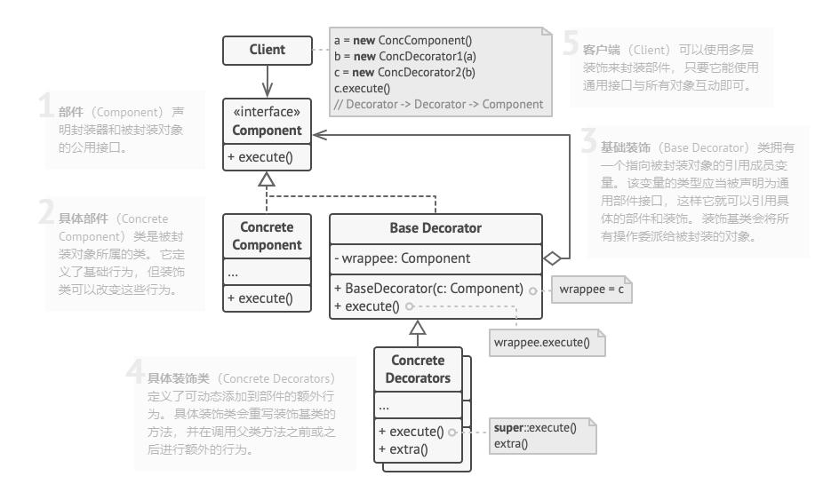

# Java——设计模式 装饰模式（封装器）
装饰模式是一种结构型设计模式，允许你通过将对象放入包含行为的特殊对象中为原来对象绑定新的行为结构。
## 装饰模式结构

1. **部件**（Component）声明封装器和被封装对象的公用接口。
2. **具体部件** （Concrete Component）类是被封装对象所属的类。它定义了基础行为，但装饰类可以改变这些行为。
3. **基础装饰** （Base Decorator）类拥有一个指向被封装对象的引用成员变量。该变量的类型应当被声明为通用部件接口，这样
它就可以引用具体的部件和装饰。装饰的基类会将所有的操作委派给被封装的对象。
4. **具体装饰类** (Concrete Decorators) 定义了可添加到部件的额外行为。具体装饰类会重写装饰基类的方法，并在调用父类方法之前或
之后进行额外的行为。
5. **客户端** （Client）可以使用多层装饰来封装部件，只要它能使用通用接口与所有对象互动即可。
## 装饰模式适用的场景
#### 如果你希望在无需修改代码的情况下即可使用对象，且希望在运行时为对象新增额外的行为，可以使用装饰模式。
#### 如果用继承来扩展对象行为的方案难以实现或者根本不可行，你可以使用该模式。
## 实现方式
1. 确保业务逻辑可用一个基本组件及多个额外可选层次表示。
2. 找出基本组件和可选层次的通用方法。创建一个组件接口并在其中声明这些方法。
3. 创建一个具体组件类，并定义其基础行为。
4. 创建装饰基类，使用一个成员变量存储指向被封装对象的引用。该成员变量必须被声明为组件接口类型，
从而能在运行时连接具体组件和装饰。装饰基类必须将所有工作委派给被封装对象。
5. 确保所有类实现组件接口。
6. 将装饰基类扩展为具体装饰。具体装饰必须在调用父类方法（总是委派给被封装对象）之前 或之后执行自身的行为。
7. 客户端负责创建装饰并将其组合成客户端所需的形式。
## 装饰模式的优缺点
### 优点
- 你无需创建新子类即可扩展对象的行为。
- 你可以在运行时添加或者删除对象的功能。
- 你可以用多个装饰封装对象来组合几种行为。
- 单一职责原则。你可以将实现不同行为的一大类拆分为多个较小的类。
### 缺点
- 在封装器栈中删除特定封装器较难。
- 实现行为不受装饰栈顺序影响的装饰比较困难。
- 各层的初始化配置代码看上去可能会很糟糕。
## 代码
- 读取和写入操作的通用数据接口——DataSource
```java
package com.wl.decorator.decorators;

import java.io.IOException;

/**
 * @author WL
 * @description: 定义了读取和写入操作的通用数据接口
 * @date 2021/9/10 15:12
 */
public interface DataSource {
	void writeData(String data) throws IOException;
	String readData() throws IOException;
}
```
- 简单数据读写器——FileDataSource
```java
package com.wl.decorator.decorators;

import java.io.*;

/**
 * @author WL
 * @description: 简单数据读取器
 * @date 2021/9/10 15:14
 */
public class FileDataSource implements DataSource {

	private String name;

	public FileDataSource(String name){
		this.name = name;
	}
	@Override
	public void writeData(String data) throws IOException {
		File file = new File(name);
		OutputStream outputStream = new FileOutputStream(file);
		outputStream.write(data.getBytes(),0,data.length());
	}

	@Override
	public String readData() {
		char[] buffer = null;
		File file = new File(name);
		try(FileReader fileReader = new FileReader(file)) {
			buffer = new char[(int) file.length()];
			fileReader.read(buffer);
		}  catch (IOException e) {
			System.out.println(e.getMessage());
		}
		return new String(buffer);
	}
}
```
- 抽象基础装饰——DataSourceDecorator
```java
package com.wl.decorator.decorators;

import java.io.IOException;

/**
 * @author WL
 * @description: 抽象基础装饰
 * @date 2021/9/10 15:24
 */
public class DataSourceDecorator implements DataSource {

	private DataSource dataSource;

	DataSourceDecorator(DataSource dataSource){
		this.dataSource = dataSource;
	}
	@Override
	public void writeData(String data) throws IOException {
		dataSource.writeData(data);
	}

	@Override
	public String readData() throws IOException {
		return dataSource.readData();
	}
}
```
- 加密装饰——EncryptionDecorator
```java
package com.wl.decorator.decorators;

import java.io.IOException;
import java.util.Base64;

/**
 * @author WL
 * @description: 加密装饰
 * @date 2021/9/10 15:38
 */
public class EncryptionDecorator extends DataSourceDecorator{

	public EncryptionDecorator(DataSource dataSource) {
		super(dataSource);
	}

	@Override
	public void writeData(String data) throws IOException {
		super.writeData(encode(data));
	}

	@Override
	public String readData() throws IOException {
		return decode(super.readData());
	}

	private String encode(String data){
		byte[] result = data.getBytes();
		for (int i = 0; i < result.length; i++){
			result[i] += (byte) 1;
		}
		return Base64.getEncoder().encodeToString(result);
	}

	private String decode(String data){
		byte[] result = Base64.getDecoder().decode(data);
		for (int i = 0; i < result.length; i++){
			result[i] -= (byte) 1;
		}
		return new String(result);
	}
}
```
- 压缩装饰——CompressionDecorator
```java
package com.wl.decorator.decorators;

import com.sun.xml.internal.messaging.saaj.util.ByteOutputStream;

import java.io.ByteArrayInputStream;
import java.io.ByteArrayOutputStream;
import java.io.IOException;
import java.io.InputStream;
import java.util.Base64;
import java.util.zip.Deflater;
import java.util.zip.DeflaterOutputStream;
import java.util.zip.InflaterInputStream;

/**
 * @author WL
 * @description: 压缩装饰
 * @date 2021/9/10 15:45
 */
public class CompressionDecorator extends DataSourceDecorator {

	private int compLevel = 6;

	public CompressionDecorator(DataSource dataSource) {
		super(dataSource);
	}

	public int getCompLevel(){
		return compLevel;
	}

	public void setCompLevel(int value){
		this.compLevel = value;
	}

	@Override
	public void writeData(String data) throws IOException {
		super.writeData(compress(data));
	}

	@Override
	public String readData() throws IOException {
		return decompress(super.readData());
	}

	private String compress(String stringData) throws IOException {
		byte[] data = stringData.getBytes();
		ByteOutputStream byteOutputStream = new ByteOutputStream(512);
		DeflaterOutputStream deflaterOutputStream = new DeflaterOutputStream(byteOutputStream,new Deflater(compLevel));
		deflaterOutputStream.write(data);
		deflaterOutputStream.close();
		byteOutputStream.close();
		return Base64.getEncoder().encodeToString(byteOutputStream.getBytes());
	}

	private String decompress(String stringData) throws IOException {
		byte[] data = Base64.getDecoder().decode(stringData);
		InputStream inputStream = new ByteArrayInputStream(data);
		InflaterInputStream inflaterInputStream = new InflaterInputStream(inputStream);
		ByteArrayOutputStream byteArrayOutputStream = new ByteArrayOutputStream(512);
		int b;
		while (((b) = inflaterInputStream.read())!=-1){
			byteArrayOutputStream.write(b);
		}
		inputStream.close();
		inflaterInputStream.close();
		byteArrayOutputStream.close();
		return new String(byteArrayOutputStream.toByteArray());
	}
}
```
- Demo ——测试
```java
package com.wl.decorator;

import com.wl.decorator.decorators.*;

import java.io.IOException;

/**
 * @author WL
 * @description: 测试
 * @date 2021/9/10 15:36
 */
public class Demo {
	public static void main(String[] args) throws IOException {
		String salaryRecords = "Name,Salary\nJohn Smith,100000\nSteven Jobs,912000";
		FileDataSource fileDataSource = new FileDataSource("out/OutputDemo.txt");
		EncryptionDecorator encryptionDecorator = new EncryptionDecorator(fileDataSource);
		DataSourceDecorator encode = new CompressionDecorator(encryptionDecorator);
		encode.writeData(salaryRecords);
		DataSource plain = new FileDataSource("out/OutputDemo.txt");

		System.out.println("- Input ----------------");
		System.out.println(salaryRecords);
		System.out.println("- Encoded --------------");
		System.out.println(plain.readData());
		System.out.println("- Decoded --------------");
		System.out.println(encode.readData());

	}
}
```