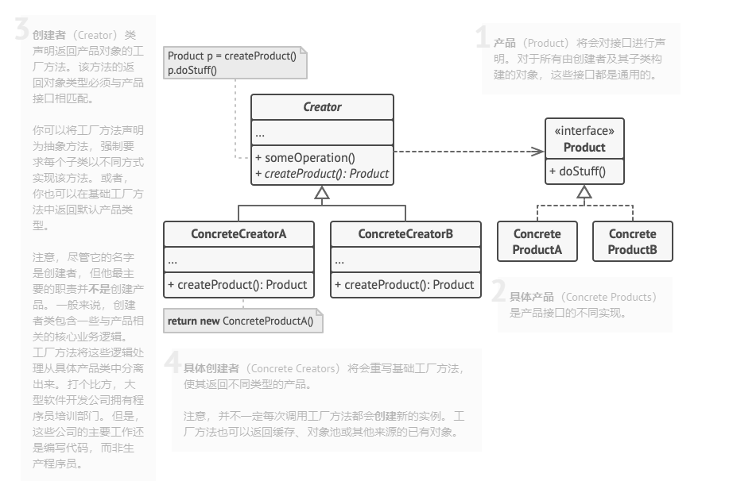
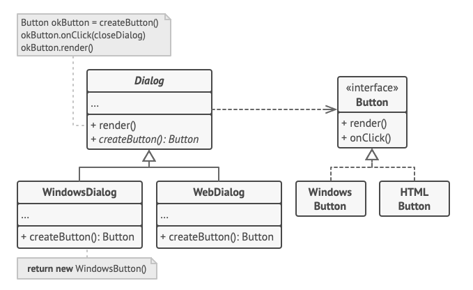

# 工厂模式
工厂方法模式是一种创建型设计模式，在其父类中提供一个创建对象的方法，允许子类决定实例化对象的类型。
## 工厂模式结构
- 产品（Product）将会对接口进行声明。对于所有创建者及其子类构建的对象这些接口都是通用的。
- 具体产品（Concrete Product)是产品接口的不同实现。
- 创建者（Creator）声明返回产品对象的工厂方法。该方法的返回对象类型必须与产品接口相匹配。
注意尽管它的名字是创建者，但它的主要职责并不是创建产品，一般来说，创建者包含一些和产品相关的核心业务逻辑。 
  工厂方法将这些逻辑处理方法从具体的产品中分离出来。打个比方，大型软件公司都有程序员培训部门，但是这些公司的主要业务还是编写代码，而不是生产程序员。
- 具体的创建者（Concrete Creator）将会重写基础工厂方法，使其返回不同类型的产品。

## 工厂模式的优缺点
- 优点 
  - 避免创建者和具体产品之间的紧密耦合
  - 单一职责原则。你可以将产品创建代码放在程序的单一位置，从而使代码更容易维护。 
  - 开闭原则。无需更改现有客户端代码你就可以在程序中引入新的产品类型。
- 缺点
  - 应用工厂方法模式需要引入许多新的子类， 代码可能会因此变得更复杂。 最好的情况是将该模式引入创建者类的现有层次结构中。
## Button

- Button
```java
package com.wl.factory.button;

/**通用产品接口
 * @author 98710
 */
public interface Button {
    /**
     * 展示呈现
     */
    void render();

    /**
     * 鼠标点击
     */
    void onClick();
}
```
HtmlButton
```java
package com.wl.factory.button;

/**
 * @Author Mr_wan
 * @Description TODO $
 * @Date $ 2021-08-30$
 * @Param 具体产品$
 * @return $
 */
public class HtmlButton implements Button {


    @Override
    public void render() {
        System.out.println("<button>Test Button</button>");
        onClick();
    }

    @Override
    public void onClick() {
        System.out.println("Click! Button to say - 'hello world'");
    }
}
```
WindowsButton
```java
package com.wl.factory.button;

import javax.swing.*;
import java.awt.*;
import java.awt.event.ActionEvent;

/**
 * @Author Mr_wan
 * @Description TODO $
 * @Date $ 2021-08-30$
 * @Param 具体产品二$
 * @return $
 */
public class WidowsButton implements Button {
    JPanel panel = new JPanel();
    JFrame frame = new JFrame();
    JButton button;
    @Override
    public void render() {
        frame.setDefaultCloseOperation(JFrame.EXIT_ON_CLOSE);
        JLabel label = new JLabel("hello world");
        label.setOpaque(true);
        label.setFont(new Font("微软雅黑",Font.BOLD,44));
        label.setBackground(Color.blue);
        label.setHorizontalAlignment(SwingConstants.CENTER);
        panel.setLayout(new FlowLayout(FlowLayout.CENTER));
        frame.getContentPane().add(panel);
        panel.add(label);
        onClick();
        panel.add(button);

        frame.setSize(320,300);
        frame.setVisible(true);
        onClick();
    }

    @Override
    public void onClick() {
        button = new JButton("Exit");
        button.addActionListener(new AbstractAction() {
            @Override
            public void actionPerformed(ActionEvent e) {
                frame.setVisible(false);
                System.exit(0);
            }
        });
    }
}
```
Dialog
```java
package com.wl.factory.button;

/**
 * @Author Mr_wan
 * @Description TODO $
 * @Date $ 2021-08-30$
 * @Param 工厂类$
 * @return $
 */
public abstract class Dialog {
    public void renderWindows() {
        Button okButton = createButton();
        okButton.render();
    }

    /**
     * 子类将重写此方法以创建特定的按钮
     * @return
     */
    public abstract Button createButton();
}
```
HtmlDialog
```java
package com.wl.factory.button;

/**
 * @Author Mr_wan
 * @Description TODO $
 * @Date $ 2021-08-30$
 * @Param 工厂-具体创建者$
 * @return $
 */
public class HtmlDialog extends Dialog{
    @Override
    public Button createButton() {
        return new HtmlButton();
    }
}
```
WindowsDialog
```java
package com.wl.factory.button;

/**
 * @Author Mr_wan
 * @Description TODO $
 * @Date $ 2021-08-30$
 * @Param 具体实现类-工厂$
 * @return $
 */
public class WindowsDialog extends Dialog{

    @Override
    public Button createButton() {
        return new WidowsButton();
    }
}
```
Demo
```java
package com.wl.factory.button;

/**
 * @Author Mr_wan
 * @Description TODO $
 * @Date $ 2021-08-30$
 * @Param 测试类$
 * @return $
 */
public class Demo {
    private static Dialog dialog;
    public static void main(String[] args) {
        config();
        runBusinessLogic();
        dialog = new HtmlDialog();
        dialog.renderWindows();
    }
    static void config(){
        if(System.getProperty("os.name").equals("Windows 10")){
            dialog = new WindowsDialog();
        } else {
            dialog = new HtmlDialog();
        }
    }
    static void runBusinessLogic(){
        dialog.renderWindows();
    }
}
```